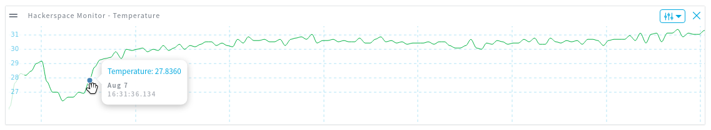

# Environmental Monitoring: Intel Edison / resin.io / ARTIK Cloud / Grove

Using a [Grove Analog Temperature Sensor](https://software.intel.com/en-us/iot/hardware/sensors/grove-temperature-sensor)
to monitor room temperature, and send it to the ARTIK Cloud.

## Setup

Use the attached `manifest.json` to create a device type on the ARTIK Cloud
and create a device with that type. Get device ID and token values from
the ARTIK Cloud dashboard.

See more info at https://docs.resin.io/integrations/artik/

## Settings

* `ARTIKCLOUD_DEVICE_ID`
* `ARTIKCLOUD_DEVICE_TOKEN`

## License

Copyright 2016 Rulemotion Ltd.

Licensed under the Apache License, Version 2.0 (the "License");
you may not use this file except in compliance with the License.
You may obtain a copy of the License at

    http://www.apache.org/licenses/LICENSE-2.0

Unless required by applicable law or agreed to in writing, software
distributed under the License is distributed on an "AS IS" BASIS,
WITHOUT WARRANTIES OR CONDITIONS OF ANY KIND, either express or implied.
See the License for the specific language governing permissions and
limitations under the License.
